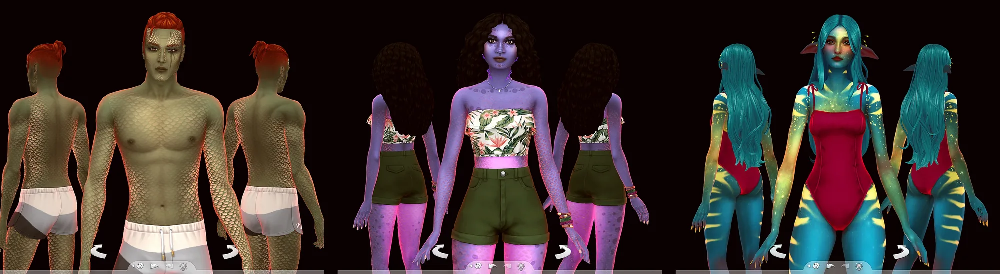
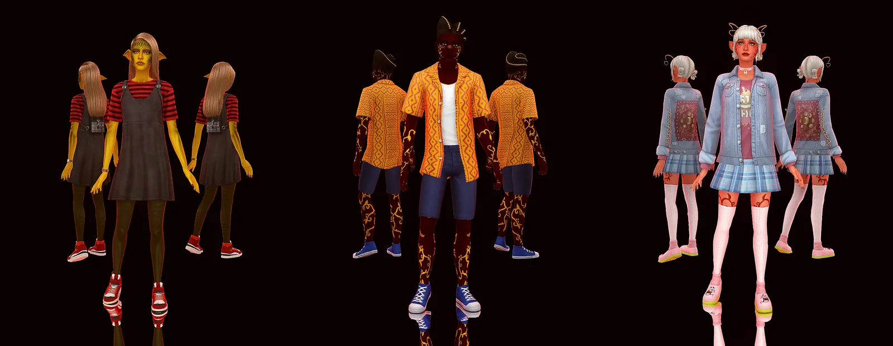
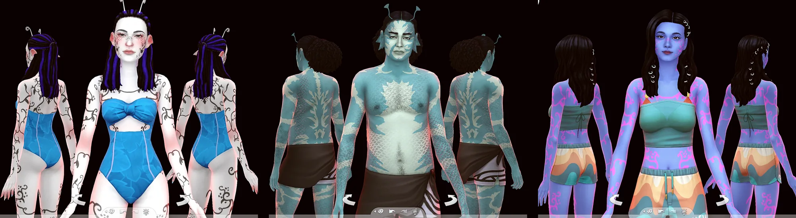
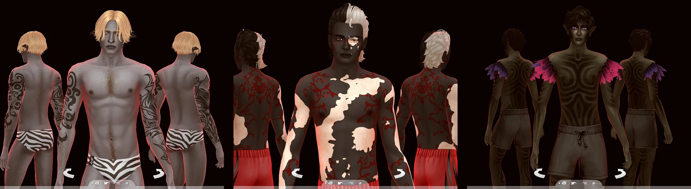
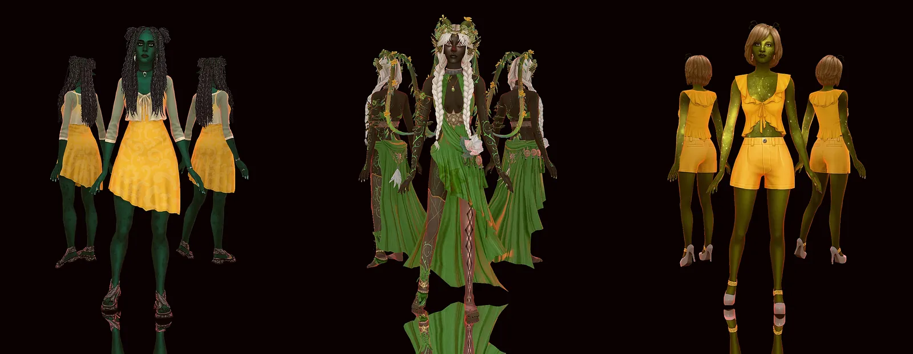
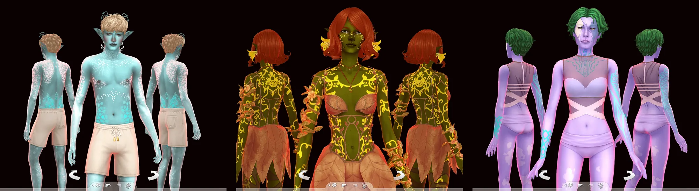

В Симнации живут не только люди.. ну, точнее, люди тут все, но кровь у них разная. Кто-то рождается с чешуёй, кто-то с кожей цвета пепла или мха, а кто-то с мозаикой, которую в одних городах считают знаком избранности, а в других — поводом присматривать повнимательнее

Всего линий крови шесть. Это не оккультизм (вампиром или феей становятся отдельно, и об этом будет своя история), а именно происхождение — то, с чем рождаются

## Коротко

| Линия | Как узнать | Где чаще живут | К чему тянутся |
| --- | --- | --- | --- |
| **терранцы** | обычная человеческая внешность | везде | — |
| **талассии** | чешуя, перламутровые полосы, холодная морская палитра | побережья и острова | к воде и русалочьей природе |
| **априции** | тёплая кожа, от терракоты до коралла | солнечные и жаркие края | к солнцу |
| **ниварии** | светлая или голубая кожа с мозаикой | горы и холод | к магии |
| **умбрии** | кожа от пепельно-лиловой до угольной, светлые разломы | туманные и ночные края | к ночи и вампирам |
| **сильваны** | зелёная кожа от мха до хвои, тёмная пятнистость | леса и поляны | к феям и живой природе |

«Тянутся» — это не правило, а склонность. Умбрий не обязан становиться вампиром, а вампир не обязан быть умбрием.. но в Форготн Холлоу, скажем так, совпадения случаются подозрительно часто

## Терранцы

Самые обычные люди и самые многочисленные. В документах их обычно никак не выделяют, потому что «нормой» по умолчанию считают именно их (что, конечно, говорит больше о документах, чем о норме)

Терранец может спокойно нести в себе чужую кровь, которая просто не проявилась. Иногда она просыпается через поколение-другое и очень удивляет всю семью

В народе: люди, обычные, гладкие

## Талассии

Дети воды. Чешуя у них бывает едва заметным перламутром, а бывает настоящими пластинами, которые уже ничем не спрячешь. Палитра холодная: бирюза, голубизна, морская зелень

Талассии чаще других становятся русалками, хотя это и не обязательно. Самый известный род — Гонгадзе с Сулани, у них русалки все до одного

Есть и талассии, которые ушли от моря. Андервуды когда-то жили на побережье, а потом берег стали делить и застраивать.. теперь они живут в Хэнфорде, где воды хватает, а моря нет

В народе: глубинники, чешуйники. Когда хотят задеть — мокрые, солёные

## Априции

Тёплая линия: кожа от золотистой и терракотовой до кораллово-красной. Живут там, где солнце не жалеет никого, — в пустынях и на юге

Из всех линий априции ближе всего к терранской «норме», поэтому их меньше сторонятся.. зато и ждут от них больше. Пустынная семья Ландграаб из Оазис Спрингс — хороший пример того, как этим можно пользоваться

Откуда пошли априции, не знает никто. Есть легенды, но про них потом

В народе: южане, прогретые

## Ниварии

Холодная линия: светлая, иногда голубая кожа и мозаика пигмента — пятна, переходы, иногда целые контрастные сектора. В одних краях выраженная мозаика считается знаком избранности, в других — аномалией, за которой лучше присматривать

Родина нивариев — гора Комореби. Там их больше всего, и там же живут духи, которых местные уважают не из вежливости, а из осторожности. Кровь нивариев легко принимает магию, и маги среди них встречаются часто. Шармы из Глиммербрука, например, говорят, что их далёкие предки пришли откуда-то с гор.. правда это или красивая семейная легенда, никто уже точно не скажет

В народе: инейники, северки, ледыши

## Умбрии

Самая тёмная линия: кожа от пепельно-серой и лиловой до сливовой и угольно-чёрной. У многих на коже светлые разломы или прожилки, будто сквозь тень что-то пробивается

Умбрии тянутся к туманным и ночным местам — Форготн Холлоу, Вранбург. Древний род Штраудов из Форготна принадлежит именно к ним, и «старая кровь», о которой любят говорить в Старших кругах, у них совсем не метафора

В народе: угольки, сажевые, ночные

## Сильваны

Лесная линия: зелёная кожа от мягкого мшистого подтона до глубокого хвойного, часто с тёмной пятнистостью, как лишайник на коре. Живут в лесах и на полянах — Иннисгрин, Гранит Фоллз, Силван Глейд

Сильванов часто связывают с феями, и не на пустом месте: к живой природе их тянет так же, как талассий к воде

(и да, зелёные бывают и талассии.. но у тех зелень холодная, морская, и обычно с чешуёй, так что спутать сложно)

В народе: лесные, мшистые, зеленушки

## Миксти

Если у ребёнка проявились сразу две линии — например, чешуя талассий и мозаика нивариев, — его записывают миксти. Но только если проявились обе: смешанные родители ещё не делают ребёнка миксти, кровь сама решает, что показать

## А как же уши, антенны и прочее?

Заострённые уши, антенки, звёздные переливы на коже встречаются у всех линий сразу и к расе не относятся. Откуда они берутся — вопрос, на который в Симнации у каждого свой ответ.. и не все эти ответы стоит произносить вслух
